# Lab Architecture

## Purpose

The lab models a small organization with one Azure virtual network and one Windows Server domain controller. It is intentionally small enough for an Azure for Students subscription while still showing infrastructure, identity, DNS, policy, and automation skills.

## Logical design

```text
Azure subscription
└── rg-adlab
    ├── vnet-adlab                    10.10.0.0/16
    │   └── snet-ad                   10.10.1.0/24
    │       └── nic-dc01              10.10.1.4 static
    │           └── DC01
    ├── nsg-dc01                      restricted RDP rule
    └── pip-dc01                      temporary administration path

DC01
├── Windows Server 2025
├── DNS
└── Active Directory Domain Services
    └── corp.brookelab.test
```

## Design decisions

- `centralus` is used because the student subscription allows it.
- A static private address keeps DNS and domain-controller references stable.
- RDP is limited to an address supplied at run time and is never stored in Git.
- One domain controller is acceptable for a learning lab, but not for production.
- The `.test` suffix prevents the lab name from pretending to be a public production domain.

## Boundary

The repository describes and automates the planned build. Its presence on GitHub does not mean the infrastructure has been deployed.

## New Lab Objectives 
**Started:** September 10, 2026

### Objective 1 — IaaS and PaaS

* [x] Add workload subnet
* [x] Build Windows VM as IaaS
* [x] Configure NSG rules
* [x] Deploy Azure App Service as PaaS

### NAT Gateway Configuration
**Date:** September 10, 2026

Created a NAT Gateway for the workload subnet to provide controlled outbound internet access.

- NAT Gateway: `nat-adlab`
- Resource Group: `rg-adlab`
- Region: `Central US`
- Public IP: `pip-nat-adlab`
- SKU: `StandardV2`
- TCP idle timeout: `4 minutes`

#### Configuration Review
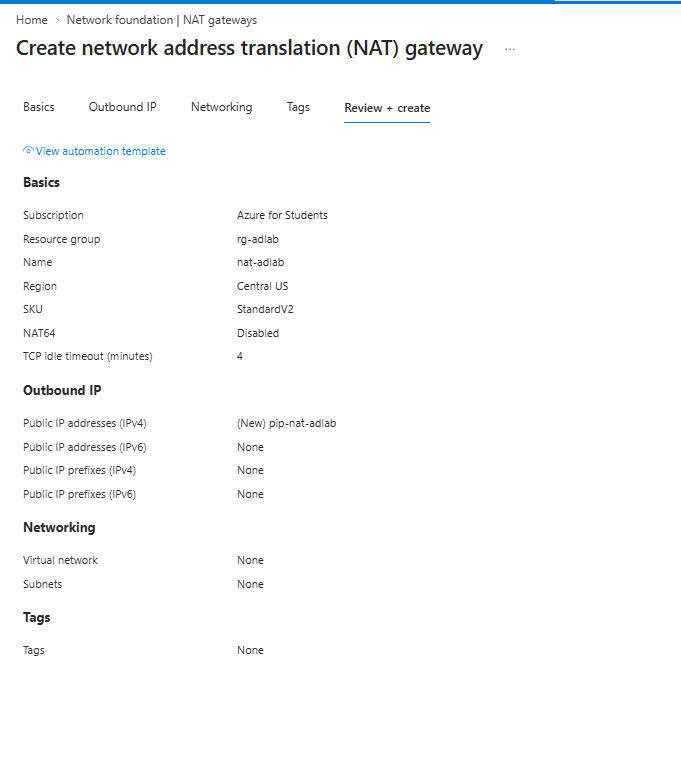

#### Deployment
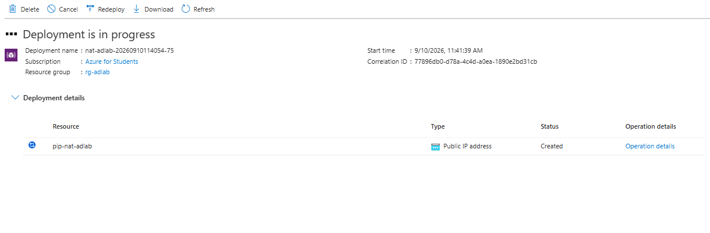

### NSG Configuration
**Date:** September 10, 2026

Created `nsg-workload` for the workload subnet.

- NSG: `nsg-workload`
- Resource Group: `rg-adlab`
- Region: `Central US`

#### Configuration Review

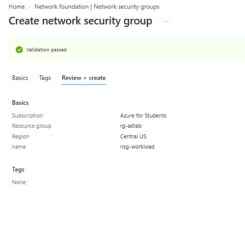

### Workload Subnet Configuration
**Date:** September 10, 2026

Created `snet-workload` as the private workload subnet.

- Subnet: `snet-workload`
- Address range: `10.10.2.0/24`
- NSG: `nsg-workload`
- NAT Gateway: `nat-adlab`

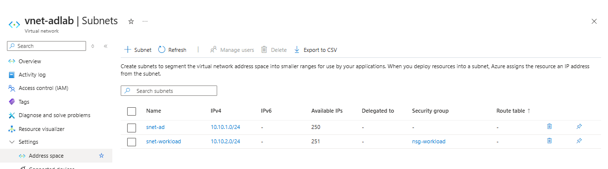

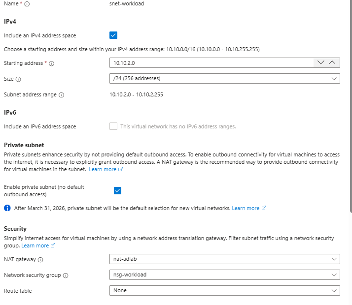

### Build Windows VM as IaaS
**Date:** September 10, 2026

#### Completed
- `vm-workload01` = working Windows Server IaaS VM
- Region = `Belgium Central`
- Image = Windows Server 2025 Datacenter: Azure Edition
- Size = `Standard_DS1_v2`
- `labadmin` = local Windows administrator account
- Status = Running

#### Deployment Notes
- Central US VM deployment failed because of VM family quota/availability.
- West US did not provide a usable VM size.
- West US 2 was blocked by Azure for Students regional policy.
- Belgium Central successfully deployed the VM.

#### Current Networking
- Azure created a Belgium Central VNet for the VM.
- Azure created `vm-workload01-nsg`.
- Azure assigned a public IP during deployment.
- The private workload network created earlier remains documented separately and is not currently attached to this VM.

#### How it fits Objective 1
- `vm-workload01` is the working hands-on **IaaS** example.

#### Deployment Proof
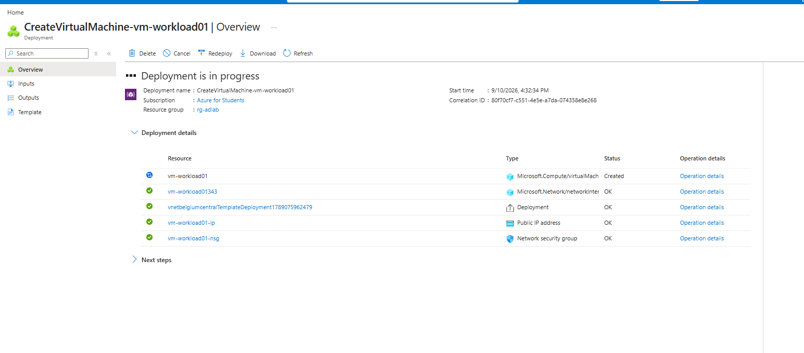

#### Running VM

### Configure NSG Rules
**Date:** September 10, 2026

#### Completed
- `vm-workload01-nsg` = NSG protecting the Belgium Central VM
- `Allow-RDP-Home` = custom inbound rule
- Port `3389` = RDP access
- Source = my current public IP only
- Priority = `1000`
- All other unmatched inbound traffic remains blocked

#### How it fits Objective 1
- The NSG controls what network traffic is allowed to reach the IaaS VM.

#### Configuration Proof
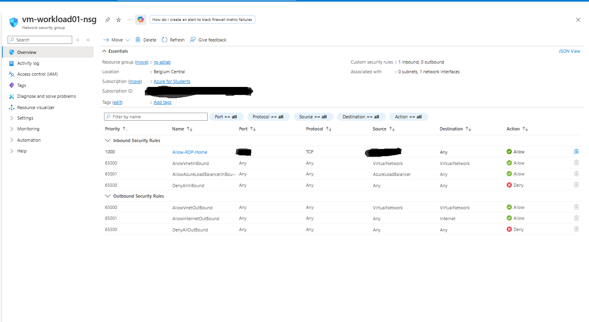

### Deploy Azure App Service as PaaS
**Date:** September 10, 2026

#### Completed
- `app-adlab-workload01` = Azure App Service
- Runtime = Python 3.12
- OS = Linux
- Region = Belgium Central
- Plan = Free F1
- `ASP-rgadlab-a433` = App Service Plan
- Deployment = Successful

#### How it fits Objective 1
- App Service is the managed **PaaS** side of the lab.

#### What is left
- Deploy a simple Python app
- Open the app URL
- Verify it runs

#### Deployment Proof
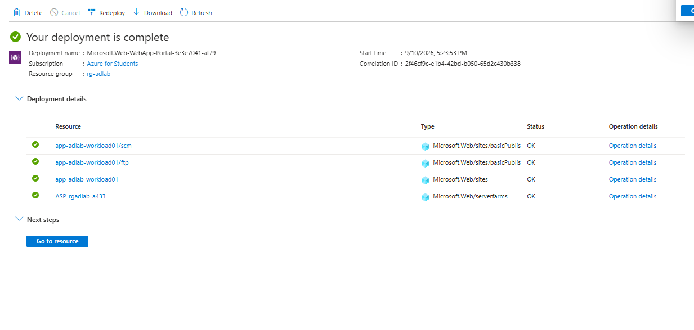

#### CLI Configuration

Configured the App Service deployment setting from Azure CLI.


#### Application Deployment

Deployed a Python Flask application to Azure App Service using Azure CLI.

- App: `app-adlab-workload01`
- Runtime: Python 3.12
- Platform: Linux
- Deployment method: ZIP deployment with Azure CLI
- Build status: Successful
- Runtime status: Started
- Browser verification: Successful

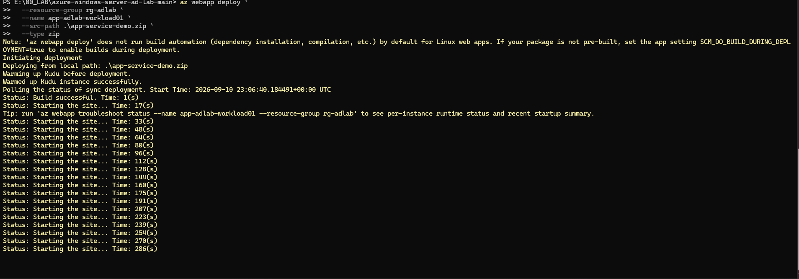

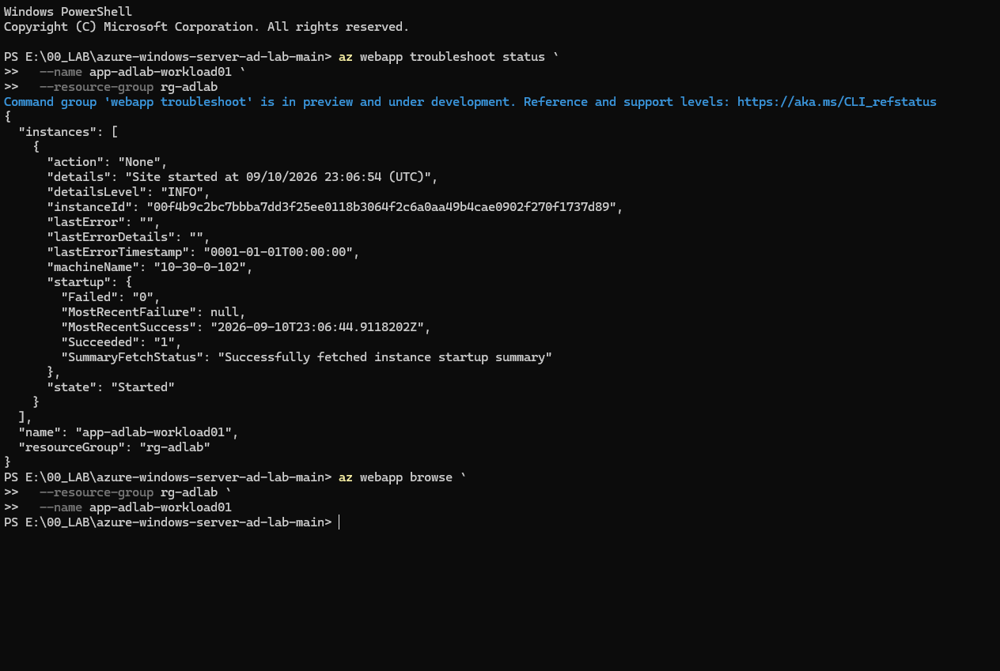

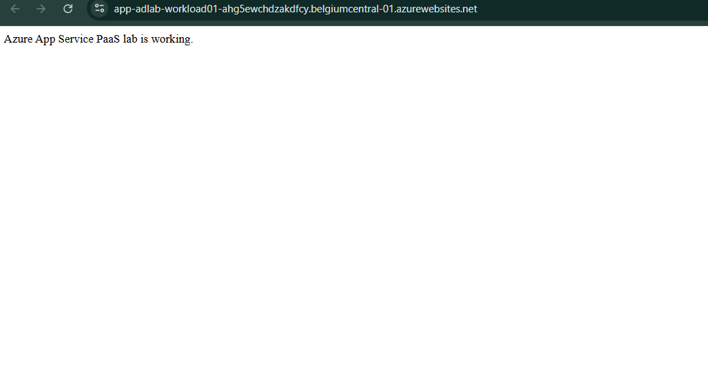

- Azure CLI ZipDeploy reported a startup timeout, but runtime diagnostics confirmed the instance started successfully and the application was verified in-browser.

### Objective 2 — Security and Compliance

* [x] Configure Entra ID access
* [x] Configure RBAC
* [x] Enable MFA
* [x] Enable MFA
* [x] Add Key Vault
* [x] Verify encryption
* [ ] Enable logging
* [ ] Review Defender for Cloud

**Updated:** September 10, 2026

- [x] Configure Entra ID access
  - Created `grp-adlab-admins`
  - Added Brooke Rayner as member

- [x] Configure RBAC
  - Assigned `Contributor` to `grp-adlab-admins`
  - Scope = `rg-adlab`

- [x] Enable MFA
  - MFA enabled for Entra user

- [x] Add Key Vault
  - Created `kv-adlab-brooke01`
  - Permission model = Azure RBAC

- [x] Verify encryption
  - `vm-workload01` OS disk uses `SSE with PMK`
  - Azure encrypts disk data at rest with a platform-managed key

- [ ] Enable logging
  - Created `law-adlab` Log Analytics workspace
  - App Service diagnostic logs configured to send to `law-adlab`
  - Installed `AzureMonitorWindowsAgent` on `vm-workload01`
  - VM Data Collection Rule setup started but is not complete yet

- [ ] Review Defender for Cloud
